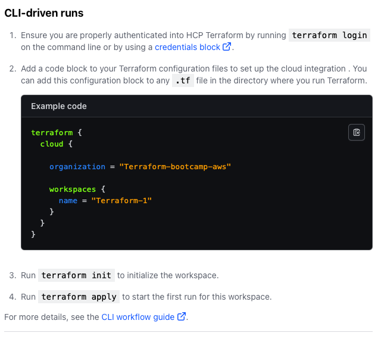

# Terraform Beginner Bootcamp 2023

### Install Terraform

Head to official docs (https://developer.hashicorp.com/terraform/install) and install Terraform for your OS.

### Install AWS cli

1. Install AWS cli following the official documentation

2. Create an AWS account; head to IAM and create a user, different from root user, and take not of AWS_ACCESS_KEY_ID and AWS_SECRET_ACCESS_KEY.

3. create local ENV vars using `export <ENV_VAR>=<value>` for:
    - AWS_ACCESS_KEY_ID 
    - AWS_SECRET_ACCESS_KEY 
    - AWS_DEFAULT_REGION 

4. To verify is aws is installed, execute:
    - `aws --version`

5. To verify user is set correctly:
    - `aws sts get-caller-identyty`

### Terraform Basics

Terraform soruces providers and modules from the Terraform registry, located at [registry.terraform.io] (https://registry.terraform.io/)

- Providers -> interfaces to APIs that allow to create resources
- Modules   -> contain multiple resources, allowing to package and re-use them

#### Terraform init

`terraform init`
downloads the binaries for the providers we will use in the project

#### Terraform plan

`terraform plan`
generates a changeset about the state of the infrastructure and resources that will be changed; this will NOT carry out the proposed changes

#### Terraform apply

`terraform apply`
runs a plan and passes the changes to be executed by terraform

#### Terraform destroy

`terraform destroy`
destroy the resources

#### Terraform Lock Files

`.terraform.lock.hcl`
contains the locked versioning for the providers or modulues that should be used with this project.

The Terraform Lock File should be committed to your Version Control System (VSC) eg. Github

#### Terraform State Files

`.terraform.tfstate`
contains information about the current state of the infrastructure

should NOT be committed to VSC

`.terraform.tfstate.backup` is the previous state file state.

#### Terraform Directory

`.terraform` directory contains binaries of terraform providers.

### Terraform Cloud

Create an account on https://terraform.io.
Create an organization (requires a unique naming).
Inside the organization create a new Workspace by choosing "CLI-Driven Workflow" and give it a name.

After the workspace is created, we get the follwing window:


1. Run `terraform login`
    1. this will prompt a web page to login in terraform cloud;
    2. After login it requires the creation of a token with expiration time
    3. copy the create token and paste it in the terminal
    4. login complete

2. Login to Terraform Cloud and go to your workspace
    1. search variables
    2. create `AWS_ACCESS_KEY_ID`, `AWS_SECRET_ACCESS_KEY`, `AWS_DEFAULT_REGION` environment variables
    3. return to your local project and execute `terraform apply --auto-approve`
    4. when the execution is completed, you can see in your workspace the resources that have been created


### Deploy a static page using S3 and CloudFront

1. create an S3 bucket from AWS console
2. create an html file with whatever content
3. copy the html file to s3
    - `aws s3 cp public/index.html s3://hkyghbeqb6wku7mzw9au7gck3zjz2xnk/index.html`
    - go to S3 and verify the file is uploaded correctly
4. to serve this file on the internet, we will create a CloudFront distribution
    - go to AWS CloudFront
    - on the left side menu click on "Origin Access" and create a new control setting 
    - create a new distribution and:
        - select the S3 bucket where we uploaded our file
        - check "origin access control" option and select the "origin access" created before
        - copy the policy that pops up and paste it in the s3 bucket under Permissions->Bucket Policy
        - disable WAF (not needed atm)
        - leave a description for the distribution
    - once the distribution is created, we can use its "Distribution domain name" to access the static html file


### Root Module Structure for TF

The structure of the root module folder is as follows:

[Standard Module Structure](https://developer.hashicorp.com/terraform/language/modules/develop/structure)

```
PROJECT_ROOT
|
|-- variables.tf        # stores input variables
|-- main.tf
|-- outputs.tf          # stores outputs
|-- providers.tf        # define providers and their configurations
|-- terraform.tfvars    # variables we want to load into terraform project
|-- README.md           # ** required
```


### Terraform Cloud Variables

[Tarraform Input Variables](https://developer.hashicorp.com/terraform/language/values/variables)

In terraform we can set two kind of variables:

Enviroment Variables - those you would set in your bash terminal eg. AWS credentials
Terraform Variables - those that you would normally set in your tfvars file

### Loading Terraform Variables

1. **var flag**
    - `-var` flag to set an input variable or override a variable in the tfvars file eg. `terraform -var user_ud="my-user_id"`
2. **var-file flag**
    - this flag allows to specify which `*.tfvars` file to use
3. **terraform.tvfars**
    - This is the default file to load in terraform variables
4. **auto.tfvars**
    - files ending in `auto.tfvars`
5. **order of terraform variables**
    - Terraform loads variables in the following order, with later sources taking precedence over earlier ones:
        - Environment variables
        - The `terraform.tfvars` file, if present.
        - The `terraform.tfvars.json` file, if present.
        - Any `*.auto.tfvars` or `*.auto.tfvars.json` files, processed in lexical order of their filenames.
        - Any `-var` and `-var-file` options on the command line, in the order they are provided. (This includes variables set by an HCP Terraform workspace.)

## Configuration Drift

### Terraform Import
[Terraform Import](https://developer.hashicorp.com/terraform/cli/import)

Terraform import can be used to recover resource's configuration, it won't work for all resources.
Reference Terraform providers documentation for supported resources.

### Fix manual configuration

If someone deletes manually a cloud resource, we can run `terraform plan` to let terraform put back the infrastructure into the expected state.


## Terraform Module

[Terraform Module](https://developer.hashicorp.com/terraform/language/modules/sources)

We can pass variables to a module.
Each module has to declare the variables in its own `variables.tf` file.